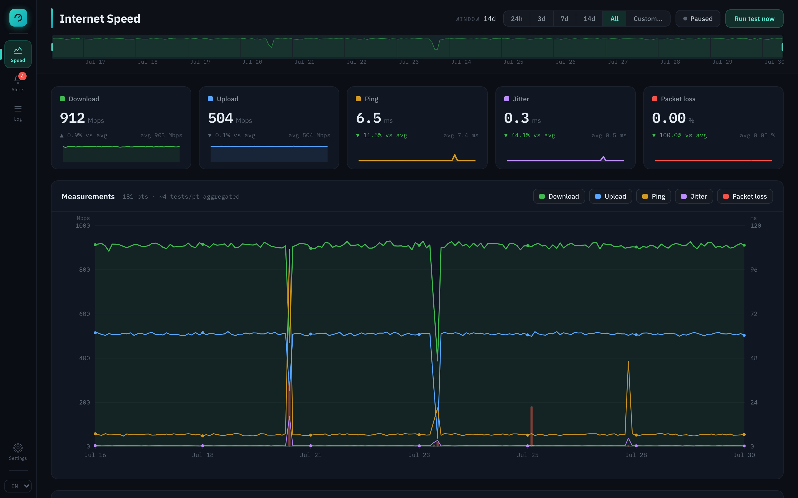
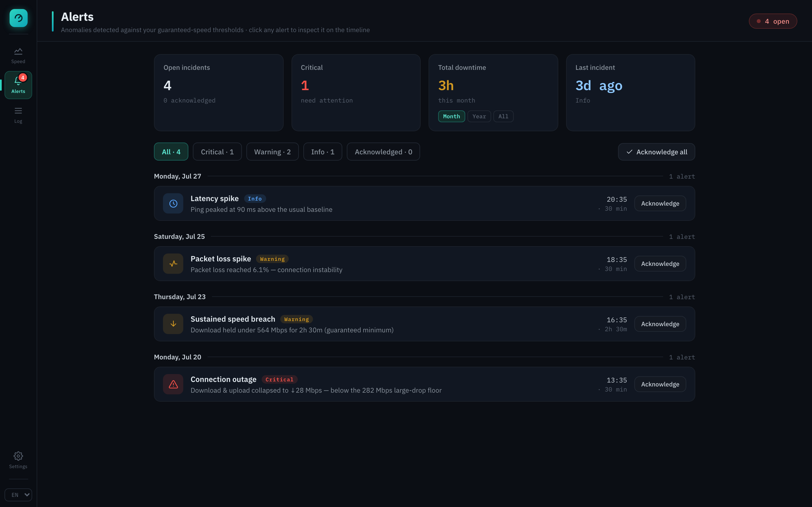
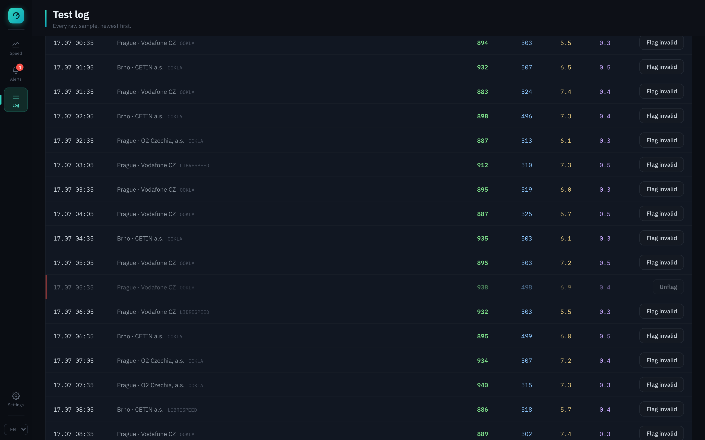
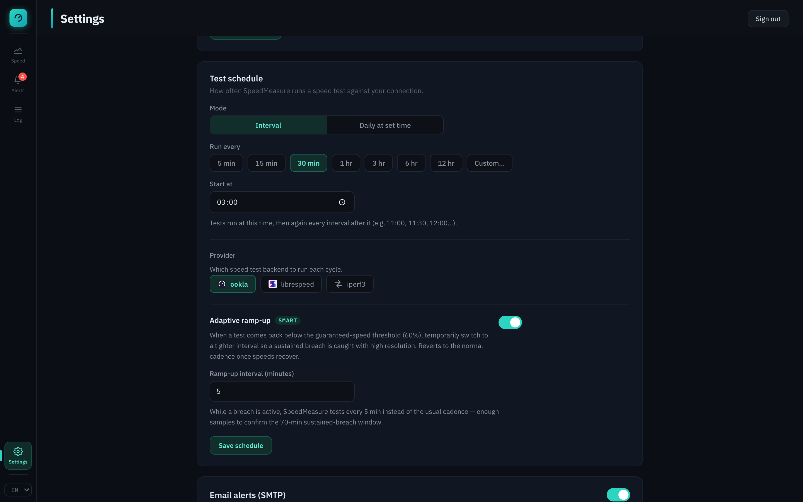

<p align="center">
  
</p>

<h1 align="center">SpeedMeasure</h1>

<p align="center">
  Self-hosted internet speed monitoring. Runs speed tests on a schedule, keeps years of results, and alerts you when your ISP drops below the speed you're paying for.
</p>

<p align="center">
  
</p>

## Quick start

1. *Get the source code*: clone with git, or download and unzip:

   ```sh
   git clone https://github.com/Screedy/SpeedMeasure.git
   cd SpeedMeasure
   ```

2. *Create your config from the template*:

   ```sh
   cp .env.example .env
   ```

   Open `.env` and set `POSTGRES_PASSWORD` and `SESSION_SECRET` — generate each with:

   ```sh
   openssl rand -hex 32
   ```

   Leave everything else at its default if you're just trying this out on
   `localhost:8080`. Putting the app behind a reverse proxy or reachable by a LAN IP requires to set `ORIGIN` in `.env` to match exactly how you'll reach it (SvelteKit
   rejects every form submission if the request's origin doesn't match what's configured).

3. Start:

   ```sh
   docker compose up -d
   ```

4. Open <http://localhost:8080>.

## Features

### Monitoring

- Run speed tests on a schedule using **Ookla**, **LibreSpeed**, or your own **iperf3**
  server. Records download, upload, ping, jitter and packet loss.
- Interactive chart: toggle, drag to zoom, rolling presets (24h/3d/7d/14d/all) or a pinned custom range.
- **Live mode** follows new results as they land, no refresh needed.
- Stat cards for each metric with a delta against your average.
- Raw results table with search, sortable columns, pagination.

### Test log & data hygiene

- Every raw sample, searchable and sortable.
- Ability to flag a test as invalid.

### Configuration

- **Schedule**: fixed interval or daily-at-a-set-time.
- **Adaptive ramp-up**: automatically switches to a tighter interval while a breach is
  active, so a sustained drop gets caught with high-resolution samples, then reverts once
  speeds recover. *(still needs testing)*
- **Guaranteed speed**: set your advertised plan and the percentage of it your ISP is
  actually obligated to sustain.
- SMTP setup with a one-click test email.

## Screenshots

<p align="center">
  
  
</p>
<p align="center">
  
</p>

## Learn more

- [CONTRIBUTING.md](CONTRIBUTING.md): stack, architecture, adding a speed-test provider,
  adding a language, where the styles live, how alerts work, changing the database schema,
  dev server and tests.
